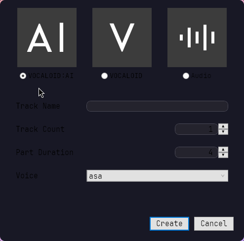
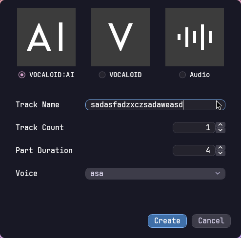

# vocaloid6-ui-patch

Catppuccin restyle for **VOCALOID 6** dialogs when running under Wine.

| Before | After |
|:---:|:---:|
|  |  |

VOCALOID 6's dialog windows (Add Track, etc.) use flat, light Win32-style
control templates hardcoded into `VOCALOID6.dll` (`DialogFlatButton`,
`DialogFlatComboBox`, `DialogRadioButton`, dotted focus rectangles, `#0078D7`
accents). No Wine visual style or WPF theme assembly can restyle them, because
the app assigns its own styles explicitly.

This patch is a tiny .NET **startup hook** (`DOTNET_STARTUP_HOOKS`) that loads
inside the VOCALOID6 process and restyles every `Yamaha.VOCALOID.DialogBase`
window at runtime with a dark, rounded Catppuccin-flavored look — mauve radio
buttons and checkboxes, dark rounded text fields, combo boxes and list boxes,
and a blue default button.

**No file of the VOCALOID installation is modified.** The hook is registered
per wine prefix via `HKCU\Environment`; it loads into other .NET processes in
the prefix but exits immediately unless the process is `VOCALOID6`. It is
independent of the wine build and survives VOCALOID updates (as long as the
dialogs still derive from `Yamaha.VOCALOID.DialogBase` on .NET 8).

## Install (Arch)

```bash
git clone <this repo>
cd vocaloid6-ui-patch
makepkg -si          # or: paru -Ui
vocaloid6-ui-patch apply
```

`apply` copies the shim to `C:\ProgramData\vocaloid6-ui-patch\` in the prefix
(`$WINEPREFIX` or `~/.wine`; override with `--prefix DIR`) and sets
`DOTNET_STARTUP_HOOKS` in `HKCU\Environment`. Restart VOCALOID 6 afterwards.

Other commands: `vocaloid6-ui-patch status`, `vocaloid6-ui-patch remove`.
A non-default wine binary can be selected with `WINE=/path/to/wine`.

## Layout

- `shim/Vocaloid6UiPatch/` — the shim: `StartupHook.cs` (entry, process gate),
  `Patch.cs` (window hook + restyler), `Styles.xaml` (self-contained resource
  dictionary, parsed at runtime with `XamlReader` — no WindowsDesktop SDK
  needed at build time, so it builds with Arch's stripped `dotnet-sdk-8.0`
  against Microsoft's WPF reference assemblies, which the PKGBUILD fetches as
  a checksummed nupkg).
- `vocaloid6-ui-patch.sh` — the `apply`/`remove`/`status` CLI.
- `PKGBUILD` — builds from this repository checkout.

## Notes

- The Track Count / Part Duration spinner arrow buttons and the AI/V/Audio
  tiles are app-custom controls and are intentionally left alone.
- If some other tool already sets `DOTNET_STARTUP_HOOKS` in the prefix,
  `apply` warns before replacing it.
